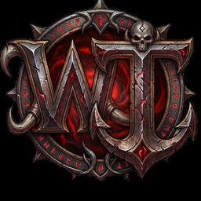

# WowTracker — Slayer Alliance Edition

<p align="center">
  
</p>

<p align="center">
  
  
  
  
  
</p>

---

## Over WowTracker

WowTracker (voorheen **DelveTracker**) is een complete WoW addon suite voor **Retail 12.0.5 (Midnight)**, gebouwd door **DieOuwe** van Slayer Alliance op Sporeggar-EU.

De addon biedt een geïntegreerd dashboard voor Prey Hunt tracking, Bounty Delves, Warband karakter beheer, currency scanning en meer — allemaal in één professionele interface.

---

## Features

| Module | Beschrijving | Slash Command |
|---|---|---|
| **Core** | 760px breed hoofdscherm · event ticker · live klok · scaling | `/dt` `/delves` |
| **Prey Tracker HUD** | Kompas naald · 3-tier fallback · affix detectie · Midnight zones | `/prey` `/pton` `/ptoff` |
| **Bounty Tracker** | Nemesis · Bountiful · Normal tabs · Valeera XP bar · story tracker | `/dt3` `/tb3` |
| **Registry XL** | Groot karakter index per klasse · currency tooltip · armory link | `/crew` |
| **UserInfo / Armory** | 3D model viewer · gear · iLvl · spec · warband stats | `/userinfo` `/cdb` |
| **Charmory** | Karakter armory popup met schaal | `/charmory` |
| **ClothCounter** | Warband stof tracker · Silver/Gold · cooldown scanner | `/cbud` `/cloth` |
| **SkinNRare / Majestic Tracker** | Rare beast waypoints · zone filter · track/lure | `/snr` `/mt` |
| **Lockout Scanner** | Raid/dungeon lockouts · currency IDs · professions | `/dtlockout` `/dtprof` |
| **Exchange Bot** | Currency exchange assistent | `/cbot` `/cureset` |
| **Events** | Live world event timer met countdown · scrollende ticker | `/dtevents` |
| **Combat Announcer** | Grote combat tekst aankondigingen | `/cset` |
| **AFK Screen** | Volledig scherm AFK display met stats · loot history · guild chat | `/dtafk` `/dtgrid` |
| **Debugger** | In-game log viewer · DB inspector · memory monitor | `/dtdebug` |

---

## Installatie

```
Interface/AddOns/WowTracker/
├── WowTracker.toc
├── WowTracker.xml
├── Core/
│   └── WowTracker.lua
├── Media/
│   ├── Icons/
│   ├── Avatars/
│   └── *.tga  (MijnIcoon, Dieouwe, kelsey, etc.)
└── Plugins/
    ├── PreyTracker/    DT_preytracker.lua + DT_prey_ui.lua
    ├── Events/         DT_events.lua + DT_events_ui.lua
    ├── UserInfo/       DT_userinfo.lua
    ├── QuickSet/       DT_QuickSet.lua
    ├── Registry/       DT_Registry.lua
    ├── ClothCounter/   DT_ClothCounter.lua
    ├── SkinNRare/      DT_SkinNRare.lua
    ├── Lockout/        DT_Lockout.lua
    ├── Exchangebot/    DT_exchangebot.lua
    ├── Charmory/       DT_Charmory.lua
    ├── CombatAnnouncer/
    ├── TooltipExtra/
    ├── SystemTools/
    ├── Media/          DT_Media.lua
    ├── HelpGuide/
    ├── CustomAFK/      DT_CustomAFK.lua
    ├── ContentManager/ DT_ContentManager.lua
    ├── Overlay/        DT_Overlay.lua
    └── Debugger/       DT_Debugger.lua
```

---

## Slash Commands — Volledig overzicht

```
/dt  of  /delves        — Open/sluit hoofdscherm
/dt1  /tb1  /dt guild   — Guild tab
/dt2  /tb2  /dt delves  — Delves karakter lijst
/dt3  /tb3  /dt bounty  — Bounty / Prey Hunt tab

/prey   /pton  /ptoff   — Prey Tracker HUD aan/uit
/crew                   — Registry XL karakter index
/userinfo  /cdb  /chardash — Karakter dashboard
/charmory               — Armory popup

/cbud  /cloth           — ClothCounter widget
/snr   /mt   /snrpop    — SkinNRare / Majestic Tracker
/dtevents               — Events panel
/dtlockout  /dtprof     — Lockout & profession scanner
/cbot  /cureset         — Exchange Bot

/dtafk  /dtgrid         — AFK screen
/dtdebug                — Debug console
/dthelp                 — Help guide
/cset                   — Combat Announcer settings
/dmenu                  — Tooltip extra menu

/dtmem                  — Addon geheugengebruik
/dtcombat               — Combat alert toggle
/dtreload               — Snelle UI reload
```

---

## Technische details

- **Interface**: `120005` (Midnight 12.0.5 / Build 67314)
- **SavedVariables**: `DelveTrackerDB`, `DT_CustomAFK_Settings`, `ClothWarbandDB`
- **Font**: `Fonts\2002.ttf` (FRIZQT__.TTF verwijderd in 12.x — volledig gefixt)
- **Deprecated APIs gefixt**: `OptionsSliderTemplate`, `UIDropDownMenu`, `GetCurrencyInfo`, `getglobal`
- **Geen taint**: alle drag/move achter `InCombatLockdown()` guards
- **Prey kompas formule**: `math.atan2(dx, -dy)` · `SetRotation(-angle)` — in-game gevalideerd

---

## Changelog

Zie [CHANGELOG.md](CHANGELOG.md) voor het volledige versie overzicht.

**v2.7.0 — 2026-06-07**
- Core herbouwd naar 760px breed (was 420px)
- Event ticker bovenaan met live klok en scrollende world events
- GetMoney() fix — goud nu correct opgeslagen per karakter
- 67× FRIZQT__.TTF → 2002.ttf crash fix
- RegisterPlugin toegevoegd voor alle 5 ontbrekende plugins
- Murloc menu uitgebreid: Characters · Trackers · Settings · Systeem
- Scaling via +/- knoppen (stap 0.05, traag genoeg voor controle)
- UserInfo gepind bovenaan admin plugin lijst
- DieOuwe karakter image verwerkt in admin panel en guild tab
- Race conditions gefixt in SystemTools en HelpGuide

---

## Slayer Alliance

> *Sporeggar-EU · Est. 2008 · Horde*

- 🌐 **Website**: [slayeralliance.com](https://slayeralliance.com)
- 💬 **Discord**: [discord.gg/y8Pu5qsEbQ](https://discord.gg/y8Pu5qsEbQ)
- 🎮 **CurseForge**: [DelveTracker Slayer Alliance Edition](https://www.curseforge.com/wow/addons/delvetracker-slayer-alliance-edition)

---

## Licentie

Copyright © 2024–2026 DieOuwe / Slayer Alliance  
Zie [LICENSE](LICENSE) voor de volledige licentietekst.
