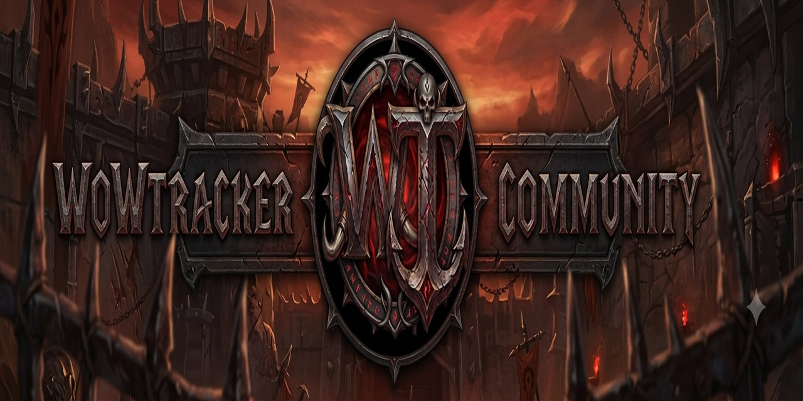

# WowTracker — Slayer Alliance Edition

> **WoW: Midnight · Interface 120005 · Build 67314**  
> Multi-plugin warband tracker for World of Warcraft Midnight (12.0.5)

[](https://github.com/Die0uwe/WowTracker)
[](https://worldofwarcraft.com)
[](https://slayeralliance.com)
[](https://github.com/Die0uwe/WowTracker-Themes)
[](https://github.com/Die0uwe/WowTracker-i18n)

---

## Features

### Main Interface
- **6-tab UI** — Guild · Delves · Bounty · Roster · Armory · Currency
- **Scrolling event ticker** met live klok, world events, Prey Hunt en Abundance
- **Theme selector** (🎨) — SA Dark · ProfBuddy Purple · MailVault Blue · Night Black
- **Language selector** (🌐) — NL · EN · DE · FR · ES
- **Murloc button** — sleep vrij, volledig context menu met 4 secties
- **Admin panel** — via ⚙ WoW Settings, sliders, plugin on/off
- **Scale knoppen** (+/−) — UI schaal 0.5× tot 2.0×

### Tab 1 — Guild
- Gilde naam en MOTD gecentreerd
- Live online leden lijst rechts met klasse kleur en level
- Guild emblem · Kelsey · DieOuwe afbeeldingen

### Tab 2 — Delves
- **2-koloms layout** — warband karakters alphabetisch
- Live zoekbalk met **letter-suggesties dropdown**
- Per karakter: faction · klasse icoon · naam · spec · iLvl · delve voortgang · gold
- Uniforme opmaak en tooltips beide kolommen

### Tab 3 — Bounty
- **Nemesis** subtab: actieve Nemesis delve + Required Items
- **Abundance info blok**: actieve zone · timer · Shard of Dundun count
- **Bountiful** subtab: live detectie via C_AreaPoiInfo
- **Normal** subtab: alle normale delves

### Tab 4 — Roster
- **ProfessionBuddy-stijl kaartjes** (3 kolommen)
- Race portrait via `raceicon128-{race}-{gender}` atlas (alle rassen inclusief Midnight)
- Spec icoon in hoek van race portrait
- Naam in klasse kleur · Lvl · Spec · iLvl · delve voortgang · professions

### Tab 5 — Armory
- **3D model viewer** embedded (Charmory)
- **Stats panel** rechts: gear · stats · currencies · gold
- `/charmory` of `/armory` voor standalone popup

### Tab 6 — Currency
- Warband currency overzicht per karakter
- **Horizontale scroll** per karakter rij met ◀ ▶ pijlen
- Live iconen via `C_CurrencyInfo.GetCurrencyInfo()`
- **28 currencies**: Midnight → War Within → Dragonflight → Shadowlands → BfA → PvP
- Filter op currency naam of expansie

---

## Race Icons
Alle speelbare rassen ondersteund via de `raceicon128-*` atlas:

| Ras | Atlas key | Status |
|---|---|---|
| Human, Orc, Dwarf, NightElf | `human`, `orc`, `dwarf`, `nightelf` | ✅ |
| Undead/Forsaken/Scourge | `scourge` | ✅ fixed v3.0.7 |
| Tauren, Gnome, Troll, BloodElf | `tauren`, `gnome`, `troll`, `bloodelf` | ✅ |
| Draenei, Goblin, Worgen, Pandaren | `draenei`, `goblin`, `worgen`, `pandaren` | ✅ |
| Nightborne, HighmountainTauren | `nightborne`, `highmountain` | ✅ |
| VoidElf, LightforgedDraenei | `voidelf`, `lightforged` | ✅ |
| ZandalariTroll, KulTiran | `zandalari`, `kultiran` | ✅ |
| DarkIronDwarf, MagharOrc | `darkirondwarf`, `magharorc` | ✅ |
| Mechagnome, Vulpera, Dracthyr | `mechagnome`, `vulpera`, `dracthyr` | ✅ |
| Earthen | `earthen` | ✅ |
| Harronir/Haranir (Midnight) | `AlliedRace-Crest-Haranir` fallback | ✅ |

---

## Plugins (20+)

| Plugin | Slash | Beschrijving |
|--------|-------|--------------|
| **Charmory** | `/charmory` `/armory` | 3D karakter armory + stats |
| **ClothCounter** | `/cbud` `/cloth` | Stof tracker warband-breed |
| **CombatAnnouncer** | `/cset` | Combat tekst aankondigingen |
| **ContentManager** | — | Content kalender |
| **CustomAFK** | `/dtafk` `/dtgrid` | AFK scherm layout |
| **Debugger** | `/dtdebug` | In-game log & DB viewer |
| **Events** | — | World events + Abundance scanner v2.0 |
| **ExchangeBot** | `/cbot` | Currency exchange tool |
| **HelpGuide** | `/dthelp` | Help scherm |
| **Lockout** | `/dtlockout` | Raid & dungeon lockouts |
| **MailAttach** | `/dtmail` | Quick Attach bij mailbox |
| **Media** | — | Zone media manager |
| **Overlay** | — | UI overlay systeem |
| **PreyTracker** | `/prey` `/pton` `/ptoff` | Prey Hunt kompas HUD |
| **QuickSet** | — | Bounty delve tracker |
| **Registry** | `/crew` | XL karakter index |
| **SkinNRare** | `/snr` `/mt` | Skin & rare tracker |
| **SystemTools** | `/wt-mem` `/wt-reload` | Systeem tools |
| **TooltipExtra** | — | Extra tooltip informatie |
| **UserInfo** | — | Karakter info |

---

## Slash Commands

```
/wt  /dt  /delves          Open/sluit de tracker
/wt1 .. /wt6               Spring direct naar tab
/prey  /pton  /ptoff        Prey Tracker kompas HUD
/crew                       Registry XL karakter index
/charmory  /armory          3D karakter armory
/cbud  /cloth               ClothCounter
/snr  /mt                   SkinNRare tracker
/dtlockout                  Lockout scanner
/cbot                       ExchangeBot
/dtafk  /dtgrid             AFK scherm
/dtdebug                    Debug console
/dthelp                     Help scherm
/dtmail                     Mail Attach panel
/wt-reload                  UI herladen
/wt-mem                     Geheugengebruik
```

---

## Installation

1. Download de [laatste release](https://github.com/Die0uwe/WowTracker/releases)
2. Pak uit in `World of Warcraft/_retail_/Interface/AddOns/`
3. Map moet `WowTracker` heten
4. Log in → `/reload`

**Eerste gebruik:** Log 1x in op elk karakter zodat race/gender data wordt opgeslagen.

---

## Community

### 🎨 Guild theme maken
Fork **[WowTracker-Themes](https://github.com/Die0uwe/WowTracker-Themes)**

### 🌐 Vertaling toevoegen
Fork **[WowTracker-i18n](https://github.com/Die0uwe/WowTracker-i18n)**

---

## Roadmap

### v3.1 (volgende)
- [ ] L[] lokalisatie systeem in addon
- [ ] Bounty Nemesis centrering fix
- [ ] Test framework `/wt test`

### v3.0 (huidig — Midnight launch)
- [x] Race icons alle rassen via `raceicon128` atlas
- [x] Undead/Forsaken fix (`scourge` atlas)
- [x] Admin panel volledig hersteld
- [x] DB auto-migratie gender + race bij login
- [x] WowTracker Community banner + branding
- [x] Currency 28 currencies + horizontale scroll
- [x] Abundance Scanner v2.0
- [x] Roster ProfBuddy stijl kaartjes
- [x] Murloc menu 4 secties

### v2.9 (vorige sprint)
- [x] 6-tab UI volledig
- [x] Delves 2-koloms uniforme opmaak
- [x] Armory embedded Tab5
- [x] PreyTracker kompas V3.x
- [x] Media paden WowTracker

---

## Technical

| Eigenschap | Waarde |
|-----------|--------|
| Interface | `## Interface: 120005` |
| Build | `67314` |
| Expansie | Midnight (12.0.5) |
| Lua | 5.1 compatible |
| Bestanden | 23 Lua · 1 TOC · 1 XML |

---

## Links

- 🏰 **Slayer Alliance**: [slayeralliance.com](https://slayeralliance.com)
- 💬 **Discord**: [slayeralliance.com/discord](https://slayeralliance.com/discord)
- 🎨 **Themes**: [WowTracker-Themes](https://github.com/Die0uwe/WowTracker-Themes)
- 🌐 **i18n**: [WowTracker-i18n](https://github.com/Die0uwe/WowTracker-i18n)

---

*WowTracker is gebouwd door DieOuwe voor Slayer Alliance — Sporeggar EU*  
*Midnight ready · Updated 2026-06-08 · v3.0.7*
